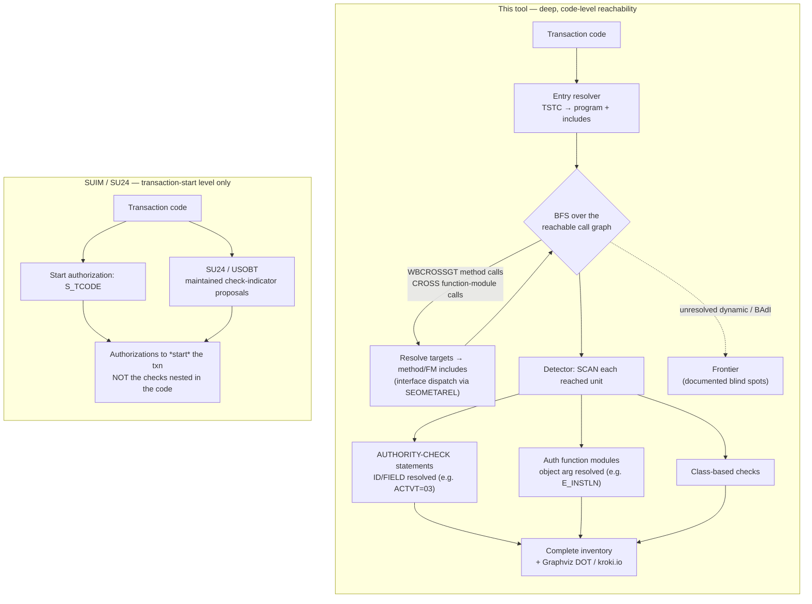
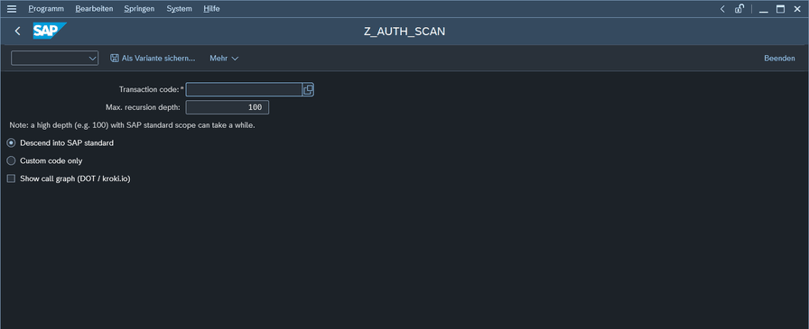

# recursive_abap_auth_check_reflection
<!-- 1 line per sentence -->

Static analyzer for SAP ABAP: given a transaction code, it recursively computes the reachable call graph and produces a **complete inventory of authorization checks** buried anywhere in the reached code - **without** running the transaction.

## Why

Users are often authorized to *start* a transaction, but the authorization checks that actually matter live deep inside the invoked program logic (nested classes, function modules, form routines).
Exercising every path at runtime is infeasible; this tool finds the checks statically.

## What it detects

- Classic `AUTHORITY-CHECK OBJECT '...'` statements
- Class-based checks (`CL_ABAP_AUTHORITY_CHECK` and similar S/4 auth APIs)
- Authorization function modules (`AUTHORITY_CHECK`, `AUTHORITY_CHECK_TCODE`, `VIEW_AUTHORITY_CHECK`, other `AUTHORITY_CHECK*` wrappers)

## How it works (in brief)

An in-system ABAP analyzer BFS-walks the call graph from the transaction entry point, using SAP's cross-reference index (`WBCROSSGT`, `CROSS`) as the edge-provider.
Dynamic/BAdI edges are resolved best-effort (and tagged provisional); anything unresolved is reported as a **frontier** blind spot.
This report depends only on standard, always-present SAP infrastructure/coding and has no dependencies on customer or other Z-code.

## How it works — and how that differs from SUIM

## Compared to SUIM

SUIM (and the underlying SU24 / USOBT check indicators) answer *"which authorizations guard **starting** this transaction"* — essentially `S_TCODE` plus the maintained check-indicator proposals.
They do **not** follow the transaction's call graph into the code.
So an `AUTHORITY-CHECK` buried in a private method several calls deep — e.g. `ISU_AUTHORITY_CHECK` on `E_INSTLN`, reached from `/UCOM/CUSTOMER` via a factory, an interface and a private method — is invisible to SUIM.

This tool is complementary: it statically walks the reachable code and reports the *actual* checks in it — the authorization object, the `ID`/`FIELD` values, and the call path that reaches them — including checks SU24 never captured.

## Compared to STAUTHTRACE (runtime authorization trace)

`STAUTHTRACE` ("Berechtigungstrace", the modern front-end that supersedes the ST01 authorization-trace workflow — ST01 itself lives on for general system tracing) is the closest SAP analogue to this tool, but it works from the opposite direction: it is a **dynamic, runtime** trace.
While the trace is active it records every `AUTHORITY-CHECK` that is *actually executed*, with the authorization object, the concrete field values, the return code, the user, and the source line — system-wide across all application servers. (Its siblings `STUSERTRACE` and `STUSOBTRACE` persist traces in the database for long-term capture and for deriving SU24 defaults.)

This tool is **static**: given only a transaction code it walks the reachable call graph and inventories every check *without running anything*.

|                                   | STAUTHTRACE (runtime trace)                          | This tool (static reachability)                              |
|-----------------------------------|------------------------------------------------------|--------------------------------------------------------------|
| Coverage                          | Only code paths actually **executed** during the trace | **All reachable** paths, including branches never exercised |
| Needs to run the scenario / data  | Yes (live, with the right test data)                 | No — analyzes without executing                              |
| Kernel / implicit checks (`S_TCODE`, `S_TABU_*`, `S_RFC`) | **Captured** (they fire at runtime)                  | **Missed** — they are not `AUTHORITY-CHECK` statements in the ABAP call graph |
| Dynamic dispatch, RFC, dynamic `SUBMIT`/`CALL TRANSACTION`, runtime BAdIs | Resolved exactly (whatever actually ran)            | Best-effort; unresolved edges are flagged **provisional / frontier** |
| Concrete field values & pass/fail RC per user | Yes — actionable for fixing a specific role         | No — reports the checked object/`ID`s, not a user's runtime result |
| False positives                   | None — every entry genuinely fired                   | Possible — reports checks on paths that may be infeasible at runtime |
| Repeatable / CI-friendly, no observer effect | No (short-term ring buffer, live capture)            | Yes — deterministic, no live run                             |
| Shows the call path reaching a check | No                                                   | Yes — from the transaction down to the check                 |

The two are **complementary**: STAUTHTRACE tells you *what actually fired, for whom, with which values*; this tool tells you *what could be reached* — a complete static inventory that does not depend on someone exercising every path. Use the static scan to find checks a trace might never hit, and STAUTHTRACE to confirm real values, return codes, and the kernel/implicit checks this tool cannot see.

## Running it

Start transaction **`ZAUTH_SCAN`** (or run report `Z_AUTH_SCAN` via `SA38`).

On the selection screen:

- **Transaction code** — the transaction to analyze (F4 help lists all transactions).
- **Max. recursion depth** — how deep to follow the call graph (default 100).
- **Descend into SAP standard** / **Custom code only** — scope of the walk.
- **Show call graph (DOT / kroki.io)** — render the reachable graph instead of the list.

The result is an ALV grouped by authorization object.
Alongside the raw `ID`/`FIELD` values, a **Description** column renders each check in plain language (e.g. `B_EMMA_CAS` + `ACTVT=03` → "Case Authorization — Display"), resolving the authorization-object and activity texts in the logon language (English fallback).

## Development coordinates

Where this lives while it is being built (in-system first; abapGit later).

- **System:** HF S/4 Mandant 100.
- **Package:** `ZAUTH_SCAN` (transportable; software component HOME, transport layer ZS4U).
- **Transport request:** `S4UK903496` (workbench, modifiable — the project TR; never released without explicit permission).
- **Message class:** `ZAUTH_SCAN` (messages 001–004).
- **Object prefixes:** `ZCL_AUTH_SCAN_*` (classes), `ZIF_AUTH_SCAN_*` (interfaces), `ZCX_AUTH_SCAN` (exception), `Z_AUTH_SCAN` (report), `ZAUTH_SCAN` (transaction), `ZAUTH_SCAN_*` (DDIC / message class).
- **abapGit:** linking this repo to the package needs a valid GitHub PAT (the MCP env-var PAT is expired/absent) — supply one before the Task 12 roundtrip.
